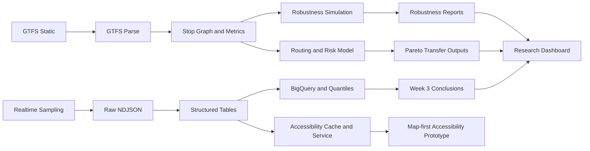

# cph-robust-transfers

[](https://www.python.org/)
[](https://github.com/isjiajia01/cph-robust-transfers)
[](https://github.com/isjiajia01/cph-robust-transfers)
[](https://github.com/isjiajia01/cph-robust-transfers/commits/main)

Reliability-aware accessibility and robust routing system for Copenhagen transit networks.

This project combines static GTFS processing, realtime transit sampling, risk-aware routing, cloud data products, and a map-first accessibility prototype in one repository.

## Key Results

- Built an end-to-end pipeline from GTFS ingestion to graph construction, realtime collection, structured analytics, and decision-facing outputs
- Added a robustness layer that evaluates transfer reliability through disruption simulation, routing, and empirical delay-risk modeling
- Integrated cloud execution patterns for recurring collection and BigQuery-based reporting instead of keeping the work notebook-only
- Produced an offline research dashboard and a lightweight accessibility-service scaffold to bridge analysis work toward reliability-adjusted accessibility products
- Structured the repo so software workflows and optimization workflows can evolve without collapsing into one-off scripts

## What This Repository Does

- Downloads and parses GTFS static data
- Builds a stop-level transit graph and graph metrics
- Samples realtime departures and journey details from Rejseplanen
- Produces structured datasets for BigQuery-based analysis
- Estimates delay risk and evaluates robust transfer candidates
- Renders an offline research dashboard for executive review
- Prototypes a map-first accessibility product with a lightweight Python server

## Project Framing

This is a hybrid research-and-engineering repository. The software side focuses on data collection, cloud jobs, and reporting pipelines. The analysis side focuses on reliability-aware accessibility, robustness, routing, and transfer-risk evaluation.

Primary framing files:

- `problem.md`
- `experiments.md`
- `docs/workflow/software.md`
- `docs/workflow/optimization.md`
- `model/formulation.md`
- `model/solver.md`

## Architecture



Core flow:

1. GTFS static zip is downloaded into `data/gtfs/raw/`
2. GTFS tables are parsed into `data/gtfs/parsed/<version>/`
3. A stop graph and graph metrics are built under `data/graph/<version>/`
4. Realtime collector polls `multiDepartureBoard` and `journeyDetail`
5. Raw payloads are stored append-only in `data/realtime_raw/dt=YYYY-MM-DD/`
6. Structured outputs are written under `data/structured/dt=YYYY-MM-DD/`
7. Quantiles, robustness outputs, and summaries feed reports and dashboards

More detail:

- `docs/architecture.md`
- `docs/runbook.md`
- `docs/next_phase_plan.md`

## Tech Stack

- Python 3.11
- Standard-library-first package layout with `setuptools`
- BigQuery and GCS integration for structured analytics flows
- Cloud Run Jobs and Cloud Scheduler for recurring collection
- Static HTML dashboard output
- Lightweight `http.server`-based accessibility service scaffold

## Repository Layout

- `src/gtfs_ingest/`: GTFS download and parsing
- `src/graph/`: graph build and network metrics
- `src/realtime/`: realtime collection, parsing, throttling, summaries, quantiles
- `src/robustness/`: disruption simulation, routing, risk model, reporting
- `src/accessibility/`: cache, upstream client, transforms, lightweight service layer
- `src/app/`: unified application-facing CLI and pipeline entry points
- `src/optimization/`: unified optimization-facing CLI and bridge API
- `configs/`: runtime defaults, station seeds, SQL templates
- `infra/gcp/`: bootstrap, deploy, scheduler, secret, and alert scripts
- `infra/bigquery/`: load, quality-check, refresh, and quantile scripts
- `docs/`: architecture, workflow, reports, conclusions, and dashboard outputs
- `model/`: formulation and solver notes
- `tests/`: regression and scaffold tests
- `web/accessibility/`: frontend shell for the accessibility prototype

## Main Entry Points

Unified root CLI:

```bash
python -m src.cli --help
python -m src.cli benchmark init
```

Application-side CLI:

```bash
python -m src.app.cli --help
```

Optimization-side CLI:

```bash
python -m src.optimization.cli --help
```

Common direct commands:

```bash
python3 -m unittest discover -s tests -p 'test_*.py'
python3 -m src.app.results_dashboard --out docs/research_dashboard.html
python3 -m unittest tests.test_accessibility_scaffold
python3 -m src.accessibility.server serve --host 127.0.0.1 --port 8765
```

## Current Outputs

Notable generated or rendered outputs already tracked in the repo:

- `docs/research_dashboard.html`
- `docs/week1_summary.md`
- `docs/week3_summary.md`
- `docs/week3_conclusions.md`
- `results/robustness/summary.md`
- `results/benchmark/README.md`

## Data and Secrets

- Runtime data under `data/` is intentionally ignored by Git
- Keep `REJSEPLANEN_API_KEY` only in environment variables or Secret Manager
- Never commit live API keys or raw secret material

## Why This Repo Matters

This repository is not just a notebook dump. It shows an end-to-end pattern:

- transport data ingestion
- realtime reliability measurement
- robustness-oriented analysis
- deployable cloud jobs
- decision-facing outputs
- early product thinking for accessibility use cases
